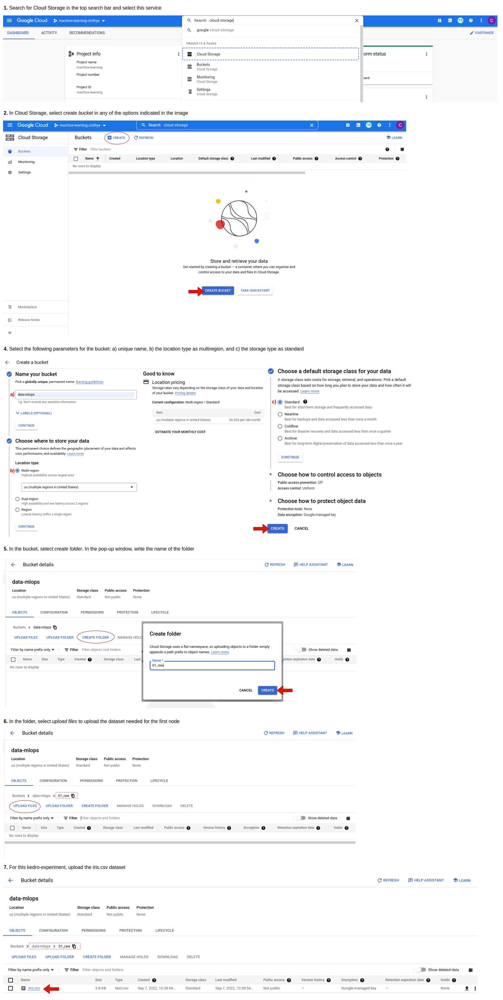
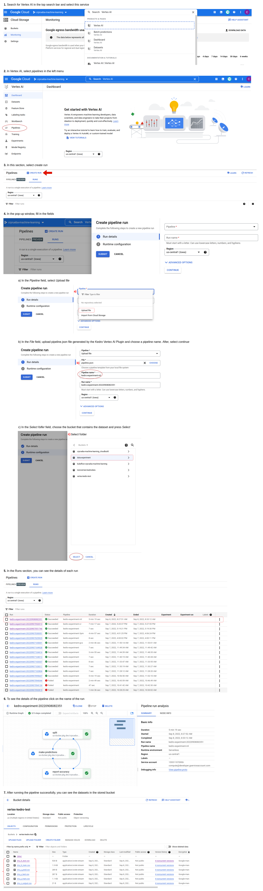

# Cloud Build + Kedro + Vertex AI | Experiment

## Purpose of the Experiment

The purpose of this experiment is to enable us to gather experience and knowledge on how to produce Docker images in the Cloud Build on GCP and then send those images to a registry services, either a Container Registry or an Artifact Registry. After that, run the Kedro pipelines on Vertex AI on GCP.

## Concepts

### Vertex AI Pipelines

This resource on GCP helps you to automate, monitor, and govern your ML systems by orchestrating your ML workflow in a serveless manner.

### ML Pipelines

ML pipelines are portable and scalable ML workflows that are based on containers. Each pipeline are composed by sets of code that perform one part of a workflow, such as data preprocessing, data transformation, and training a model. The different components of pipeline are: inputs, outputs, and the location of a container image.

## Prerequisites

Install the following Python plugins:

1. Kedro Docker

        pip install kedro-docker

2. Kedro Vertex AI

        pip install kedro-vertexai

Enable the following APIs on GCP:

1. Cloud Build API
2. Artifact Registry API
3. Vertex AI API

## Guide

1. In the root of the kedro-experiment directory, a Cloud Build configuration file (YAML format) was created to automatically do the following tasks: 1) build Docker image and 2) push Docker image to Artifact Registry.

2. Three Python packages necessary for the Docker image to work are added to the requirements.txt file: 1) numpy (version 1.21.6), 2) pandas (version 1.3.5), and 3) gcsfs (version 2022.1.0).

3. Use the *init* command with two argumentss (PROJECT_ID and REGION) to generate a sample configuration file. We run the command:

        kedro vertexai init crprueba-machine-learning us-central1
        Usage: kedro vertexai init [PROJECT_ID] [REGION]

    After to execute this command, you can see vertexai.yaml file in conf/base.

4. The catalog.yml file in conf/base was modified to add the path of the bucket where the outputs of each node will be stored.

        filepath: gs://vertex-kedro-test/iris_X_train.csv
        Usage: filepath: gs://[BUCKET_NAME]/[OUTPUT_FILE_NAME]

4. To transform Kedro pipeline into Vertex AI workflow, use the *compile* command. In our case, we run the following command in the terminal:

        kedro vertexai compile -i us-docker.pkg.dev/crprueba-machine-learning/experiment-cloud-build/kedro-experiment:tag7
        Usage: kedro vertexai -i [IMAGE_NAME]

    After to execute this command, you can see pipeline.json file in your working directory, in our case in the kedro-experiment directory.

5. In the pipeline.json file the **args** field was modified for every node because Kedro Vertex AI is not install on the image.

    We change all the args like this:

- Node: exec-make-predictions
" kedro vertexai -e local initialize-job --params='{ }' " => " kedro run -n make_predictions --params='{ }' "

- Node: exec-report-accuracy
" kedro vertexai -e local initialize-job --params='{ }' " => " kedro run -n report_accuracy --params='{ }' "

- Node: exec-split
" kedro vertexai -e local initialize-job --params='{ }' " => " kedro run -n split"

6. On GCP, create a private bucket in Cloud Storage to store the input or dataset needed for the first node. In our case, we store the iris.csv file. To know the necessary steps to create a bucket in Google Cloud Storage (GSC) see the following image:

    

7. On GCP, create a Vertex Pipeline to automate and monitor the ML systems. For this step, read the following illustrative guide:

    

> Note: For the successful of this experiment, it was necessary to modify the code of two files:
>
>- File: nodes.py
Path: Experiments/Cloud_Build_Kedro/kedro-experiment/src/kedro_experiment/nodes.py 
Changes: The return was added to the *report_accuracy* function
>
>- File: pipeline.py
Path: Experiments/Cloud_Build_Kedro/kedro-experiment/src/kedro_experiment/pipeline.py
Changes: In the *create_pipeline* function, the node output of the *report_accuracy* function was changed from *none* to *accuracy*

### Links

Kedro
<https://kedro.readthedocs.io/en/stable/>

Kedro Docker Plugin
<https://kedro-kubeflow.readthedocs.io/en/0.7.0/>

Kedro Vertex AI Plugin
<https://kedro-vertexai.readthedocs.io/en/0.6.0/source/02_installation/index.html>

Vertex AI Pipelines
<https://cloud.google.com/vertex-ai/docs/pipelines>